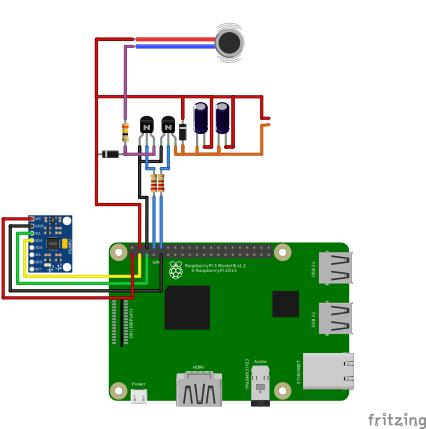
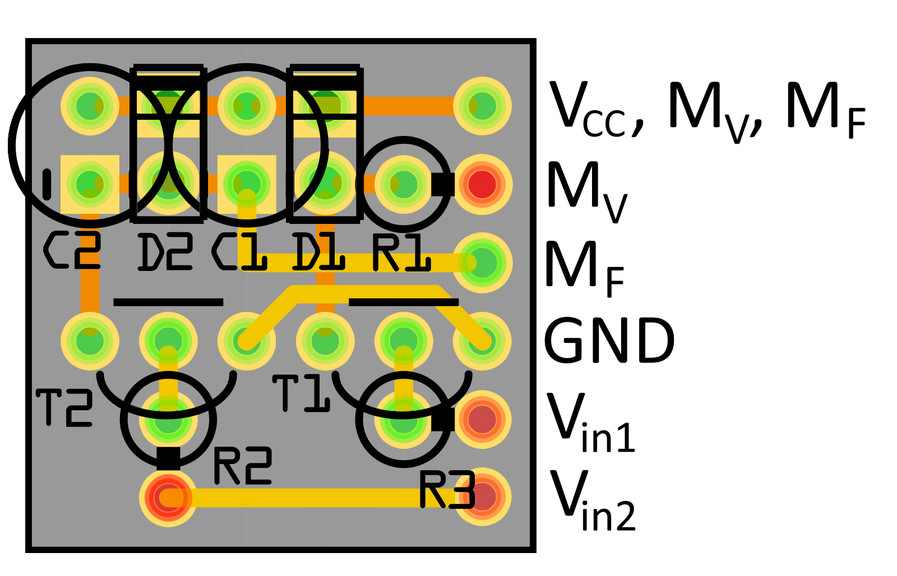
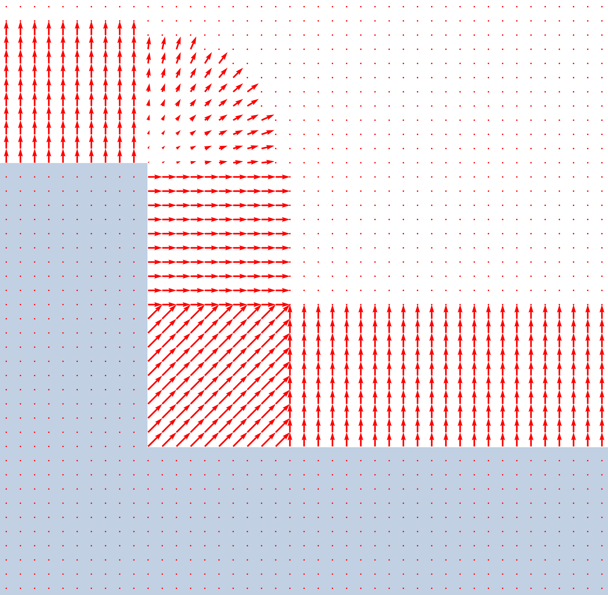

# Tilt Maze Game

## Overview

The Tilt Maze Game is inspired by the classic wooden labyrinth game where players navigate a ball through a maze by tilting the board.
This game uses a Raspberry Pi combinded with a touchscreen and a MPU6050 gyro sensor for tilt detection.
The objective of the game is to guide the ball from the start position to four checkpoints on the map while avoiding holes that will reset the ball's position. When reached the checkpoints will each reveral a number/letter combination which has to decoded. The resulting code the has to be entered to finish the game.

## The hardware

- <a href = "https://www.amazon.de/dp/B07BFH96M3?ref=ppx_yo2ov_dt_b_fed_asin_title&th=1"> Raspberry Pi 3B+ </a>
- <a href = "https://www.amazon.de/dp/B09B29T8YF?ref=ppx_yo2ov_dt_b_fed_asin_title&th=1"> 4.3" 800x480 px Waveshare Touchscreen with Case and Fan </a>
- <a href = "https://www.amazon.de/dp/B07BVXN2GP?ref=ppx_yo2ov_dt_b_fed_asin_title"> MPU6050 Gyro Sensor </a>
- <a href = "https://at.rs-online.com/web/p/entwicklungstools-fur-energie-motor-und-robotik/1845122?gb=s" > Vibration Motor </a>
- PCB with components and wires

### Cables and connections

The following image visualizes the hardware setup with all its components. The image shows a Raspberry Pi 3, but the project was actually built with a Raspberry Pi 3B+. However, it should also work with a Raspberry Pi 3. The DSI display is connected to the DSI port located on the left side. The MPU6050 gyro sensor is connected via I2C to the SDA and SCL pins of the Raspberry Pi. The vibration motor and the fan require more power than the GPIO pins can provide, therefore they are powered through a transistor circuit connected to the 5V and GND pins of the Raspberry Pi. Resistors connecting the base of the transistors to the GPIO pins are used to control the motors. To smooth out the fan rotation capacitors are connected in parallel to the fan. Diods are used to protect the circuit from voltage spikes when turning off the motors. 



The following schematic and layout show the transistor circuit with the values of the components in detail.   

### Schematic

$V_{in1}$ for the Vibration motor control is connected to GPIO 14 and $V_{in2}$ for the fan control is connected to GPIO 15. $V_{CC}$ is connected to the 5V pin of the Raspberry Pi, while $GND$ is connected to a GND pin. The flyback diods $D_1$ and $D_2$ are 1N4007 diods. The capacitance of the Capacitors sum up to $440 \mu F$ (two 220 $\mu F$ Capacitors were used, because of availability). The resistors have a resistance of $220 \Omega$ to ensure that the Transisor works as a switch/ in saturation mode. The transistors are BC547B NPN transistors. The Fan is a 5V fan, while the vibration motor is a 3V motor. Therefore the vibration motor needs a resistor of $34 \Omega$ in series to limit the current to $~80 mA$.


### PCB layout

The double layer PCB shows the placement of the components and the connections on the top and bottom layer. The dimensions of the PCB are $2 cm$ x $2 cm$.
On the left side the connections to the Raspberry Pi and the motors are located.



### Rapsberry Pi configuration
The Raspberry Pi was set up with the version 12 (Bookworm) of Raspberry Pi OS Lite (32 bit). To enable the DSI display the dtoverlay for the display driver has to be changed from the default "vc4-kms-v3d" to "vc4-fkms-v3d". This can be done by editing the file /boot/firmware/config.txt. Adding "nocomposite" ensures smoother graphics performance. The following line has to be added or changed in the config.txt file:
```
dtoverlay=vc4-fkms-v3d, nocomposite
```


## Map, ball movement and collision concept

The implementation of the map and the collision logic was a central part of the project. The map consists of walls acting as boundaries and obstacles, holes that reset the ball's position, and checkpoints which the player must reach. The map is based on a text file defining the objects.

### The map file

In the map file first the radius of holes and checkpoints is defined with the key 'r' followed by the value. Then all rectangular wall objects are defined with the key 'w' followed by coordinates of the top left and bottom right corners. The holes with the key 'h', the checkpoints with the key 'c' and the start position with 's', each are followed by the coordinates of their center.

### The map representation

In the program the map is represented by a 3D array storing a certain set of information for each pixel of the map; the first two indices of the array represent the x and y coordinates of the pixel, while the third index selects the information stored for that pixel. In the following "index" refers to the third index of the array, while the first two indices are referred to as "coordinates". In the code this array is called 'val_data'.

Index 0 defines the type of the pixel and with this if it represents a valid position for the center of the ball (will be reffered to as 'ball' in this section). The following types are defined: 

- 2: Wall; obviously the ball cannot move into walls
- 1: Wall periphery; the ball cannot move into these pixels
- 0: Valid position; the ball can move into these pixels
- -1: Hole area; the ball can move there but is drawn to the center of the hole
- -2: Hole center; the ball can move there but falls into the hole
- -3: Checkpoint; the ball can move there and reveals the number/letter pair of the checkpoint

In order to implement the collision logic it is required to know the orientation of the obstacle surface, i.e. the direction perpendicular to the surface of the wall. This information is stored in index 1 and 2 of the array as x and y components of a 2D vector for each wall periphery pixel.

If a pixel is within a checkpoint, index 3 stores the identification number of the checkpoint (0 to 3)

The data in the array is generated in the following way (after initializing the information part with zeros):

1. The walls are drawn first. For each wall the pixels within the defined rectangle are set to type 2, shown in the following figure in blue.
Also in this step holes and checkpoints are drawn - this way further layers defining forbidden areas in the periphery of walls can override them (otherwise areas to close to walls could be defined as valid position for the center of the ball).


2. Then the wall periphery is defined by adding rectangles with the width equal to the radius of the ball at each side of the wall as long as there isn't another wall at this position already. These pixels are set to type 1, shown in the figure as yellow rectangles


3. As a last step, quarter-circles with the radius of the ball are added at each (unoccupied) corner of the wall, again setting the pixels to type 1. These are shown in green in the following figure.


In step 2 and 3 besides setting the type of the pixel, also the normal vectors in the wall periphery are defined. For the rectangles in step 2 the normal vector is simply pointing away from the wall, while for the quarter-circles in step 3 the vectors were generated by taking the position of each pixel relative to the center of the quarter-circle and normalizing it.
The following figure shows the normal vectors in the wall periphery - the walls are shown in a semitransparent blue color. In the areas where two periphery rectangles overlap, the normal vectors are added, resulting in diagonal vectors, leading to the intended behavior.



### Collision logic

Since the game is designed to update the screen with $50$ Hz, the time between two frames is $20$ ms. Therefore in each frame the ball travels a certain distance based on its velocity ($s=v\cdot dt$ with $dt = 20$ ms). If the velocity is high, the ball could travel several pixels in one frame and therefore end up inside forbidden areas. To prevent this, the trajectory of the ball is divided into smaller steps of $ds = 0.1$ px length and at each step the current pixel type is checked.
The following image illustrates this process: The vector $\vec{t_1}$ represents the initial trajectory of the ball. The green dots represent the positions at which the pixel type is checked - they are separated by the step size $ds$. At the position of the red dot the trajectory enters a pixel of type 1 (wall periphery) - starting from the last valid position a new trajectory $\vec{t_2}$ is calculated based on the normal vector $\vec{n}$ stored at the position of the collision. Therefore the direction of the trajectory is mirrored at the normal vector and the length is set to the remaining distance to travel reduced by a damping factor (0.8). The new trajectory is then again divided into steps tested for collisions. On the screen the ball is only drawn on the final position of the trajectory.


The calculation of the new trajectory is done with vector algebra: 

